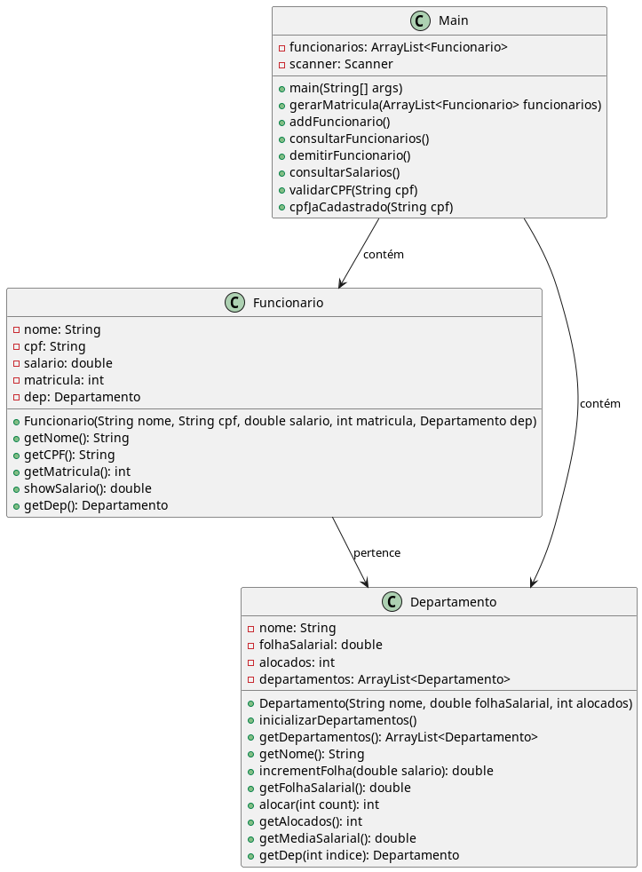

# Sistema de Gerenciamento de Funcionários

Projeto 2 do curso de Programação Orientada a Objetos do OxeTech Lab

<h2><strong>Diagrama UML: </strong></h2>

## Equipe
<ul>
  <li>Marcos Melo</li>
  <li>Gustavo Galvão</li>
</ul>

## Professor
<ul>
  <li>Ulpio Netto</li>
</ul>
